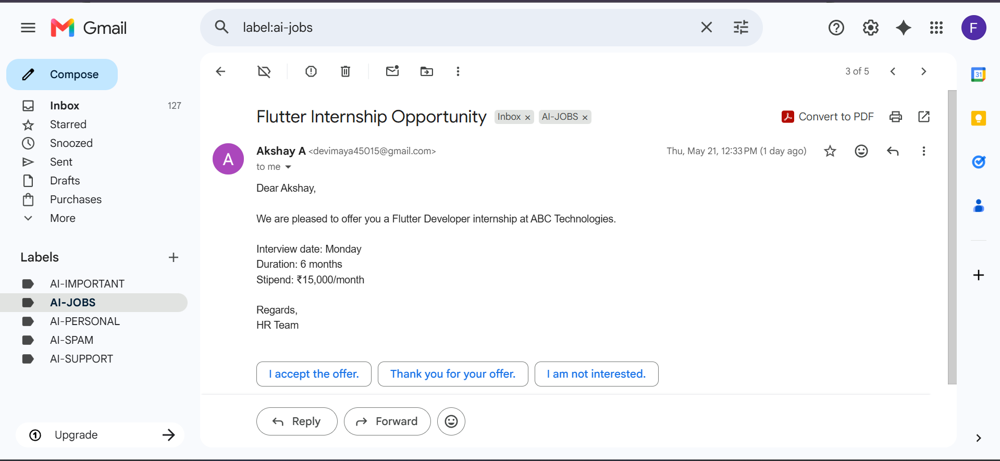

# 📧 Gmail AI Email Classifier using n8n + OpenAI

An AI-powered Gmail automation workflow built with n8n and OpenAI that automatically classifies incoming emails into categories like:

- AI-JOBS
- AI-SPAM
- AI-IMPORTANT
- AI-PERSONAL
- AI-SUPPORT

The workflow reads incoming Gmail messages, uses AI to analyze the subject and preview content, and automatically adds Gmail labels based on the detected category.

---

# 🚀 Features

✅ Real-time Gmail email monitoring  
✅ AI-powered email classification  
✅ Automatic Gmail label assignment  
✅ Spam email detection  
✅ Job opportunity detection  
✅ Important alert classification  
✅ Personal & support email categorization  
✅ Fully automated workflow using n8n

---

# 🛠️ Tech Stack

- n8n
- OpenAI API
- Gmail API
- AI Prompt Engineering
- Workflow Automation

---

# 🧠 AI Categories

| Category | Description |
|---|---|
| JOBS | Internship, hiring, recruitment emails |
| SPAM | Promotions, fake offers, marketing spam |
| IMPORTANT | Urgent alerts, server issues, approvals |
| PERSONAL | Friends, family, personal communication |
| SUPPORT | Customer issues, complaints, login issues |

---

# 🔄 Workflow Architecture


---

# 📬 Gmail Auto Classification


---

# 💼 Job Email Detection



---

# 🧩 Workflow Logic

1. Gmail Trigger detects new incoming email
2. Extract Email Fields node gets:
   - Sender
   - Subject
   - Preview
3. OpenAI classifies the email
4. Router node redirects based on category
5. Gmail automatically adds labels

---

# 🤖 AI Prompt Used

```txt
Classify this email into exactly one category:

SUPPORT
JOBS
PERSONAL
SPAM
IMPORTANT

Sender:
{{ $json.sender }}

Subject:
{{ $json.subject }}

Preview:
{{ $json.preview }}

Return ONLY one word:
SUPPORT or JOBS or PERSONAL or SPAM or IMPORTANT

Do not return JSON.
Do not explain.
Do not use markdown.
```

---

# 📁 Project Structure

```bash
gmail-ai-email-classifier/
│
├── README.md
├── Workflow.json
│
├── screenshots/
│   ├── Workflow-Architecture.png
│   ├── Gmail-Labels.png
│   ├── Job-Email-Classification.png
│
└── assets/
```

---

# 📌 Future Improvements

- Auto reply generation
- Priority scoring
- AI summary generation
- Telegram/Discord notifications
- Email sentiment analysis
- Multi-language email support

---

# 👨‍💻 Author

Akshay A

LinkedIn: www.linkedin.com/in/akshay-a-1b4960283

GitHub: https://github.com/Akshay-tech23
