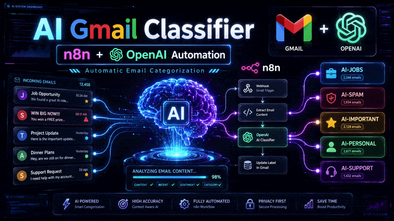
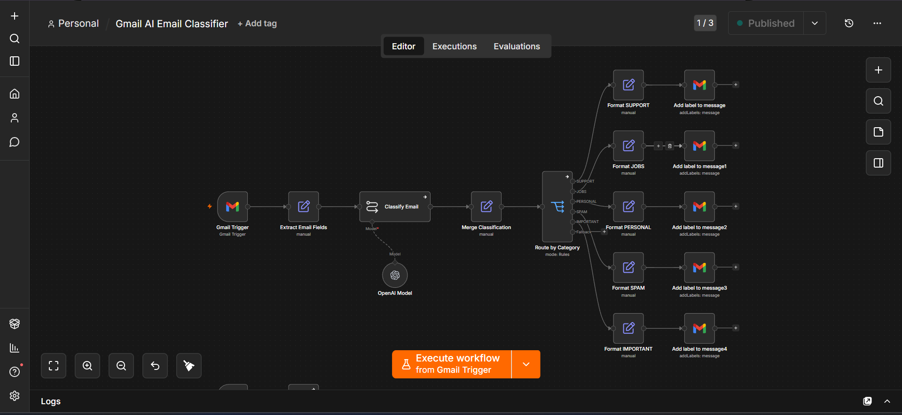
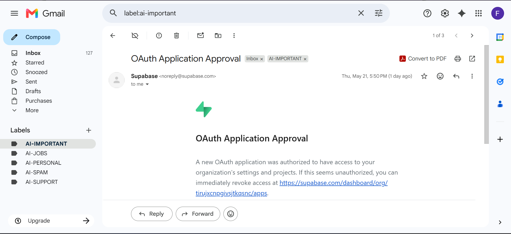
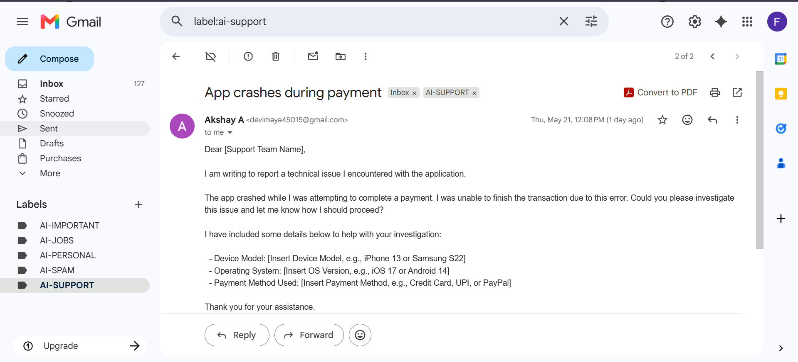

# 📧 Gmail AI Email Classifier using n8n + OpenAI

An AI-powered Gmail automation workflow built using **n8n** and **OpenAI** that automatically classifies incoming emails into intelligent Gmail categories.



---

## 🎥 Demo Video

Watch the full project demo on YouTube:

https://youtu.be/Vq5AoE36jwg

---

# 🚀 Features

✅ Real-time Gmail monitoring  
✅ AI-powered email classification  
✅ Automatic Gmail label assignment  
✅ Spam email detection  
✅ Job opportunity detection  
✅ Important alert classification  
✅ Personal & support email categorization  
✅ Fully automated workflow using n8n

---

# 🛠️ Tech Stack

- n8n
- OpenAI API
- Gmail API
- Prompt Engineering
- Workflow Automation
- AI Classification

---

# 🧠 Email Categories

| Category | Description |
|-----------|-------------|
| JOBS | Internships, recruitment, hiring emails |
| SPAM | Promotions, ads, suspicious emails |
| IMPORTANT | Urgent alerts, approvals, critical updates |
| PERSONAL | Friends, family, casual communication |
| SUPPORT | Help requests, complaints, account issues |

---

# 🔄 Workflow Architecture

```text
Gmail Trigger
     ↓
Extract Email Fields
     ↓
OpenAI Classification
     ↓
Merge Classification
     ↓
Route By Category
     ↓
Apply Gmail Labels
```

---

## Workflow Screenshot



---

# 📬 Gmail Auto Classification

## Gmail Labels Applied


---

## Job Email Detection


---

## Important Email Detection



---

## Support Email Detection



---

# 🤖 AI Prompt Used

Stored inside:

```text
prompt/classifier_prompt
```

Core Prompt:

```txt
Classify this email into exactly one category:

SUPPORT
JOBS
PERSONAL
SPAM
IMPORTANT

Sender:
{{ $json.sender }}

Subject:
{{ $json.subject }}

Preview:
{{ $json.preview }}

Return ONLY one word:
SUPPORT or JOBS or PERSONAL or SPAM or IMPORTANT

Do not return JSON.
Do not explain.
Do not use markdown.
```

---

# 🧩 Workflow Logic

1. Gmail Trigger listens for incoming emails
2. Extract Email Fields node extracts:
   - Sender
   - Subject
   - Preview
3. OpenAI classifies the email
4. Router redirects by category
5. Gmail labels are automatically assigned

---

# 📁 Project Structure

```bash
gmail-ai-email-classifier-n8n/
│
├── README.md
│
├── assets/
│   ├── demo.gif
│   └── thumbnail.png
│
├── prompt/
│   └── classifier_prompt
│
├── screenshots/
│   ├── Workflow.png
│   ├── Gmail Labels.png
│   ├── Job-Email-Classification.png
│   ├── Imporant-Email-Classification.png
│   └── Support-Email-Classification.png
```

---

# 📌 Future Improvements

- Auto reply generation
- AI email summaries
- Sentiment analysis
- Slack / Telegram notifications
- Priority scoring
- Multi-language email support

---

# 📚 Learning Outcomes

Through this project I learned:

- AI workflow automation
- Gmail API integration
- Prompt engineering
- Event-driven automation
- n8n orchestration
- AI classification systems

---

# 👨‍💻 Author

Akshay A

LinkedIn:  
https://www.linkedin.com/in/akshay-a-1b4960283

GitHub:  
https://github.com/Akshay-tech23
